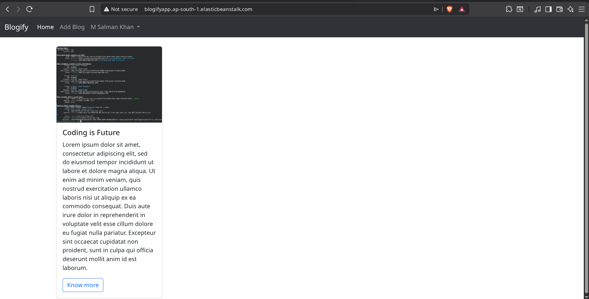

# Blogify

<p align="center">
	
	
	
	
	
	
	
	
</p>

Blogify is a full-stack blogging application built with Node.js, Express, MongoDB, and EJS. It supports user authentication, blog publishing, image uploads, and post comments through a simple server-rendered interface.

## Table of Contents

- [Overview](#overview)
- [Features](#features)
- [Tech Stack](#tech-stack)
- [Getting Started](#getting-started)
- [Environment Variables](#environment-variables)
- [Scripts](#scripts)
- [Usage](#usage)
- [Screenshots](#screenshots)
- [License](#license)

## Overview

The application uses Express for routing, MongoDB with Mongoose for persistence, and EJS templates for the UI. Authentication is handled with JWTs stored in cookies, and blog cover images are uploaded with Multer into the public uploads folder.

## Features

- User signup, signin, and signout
- JWT-based authentication with cookie support
- Password hashing with `crypto`
- Create blog posts with title, body, and cover image
- View blog detail pages with author information
- Add comments to blog posts
- Server-rendered pages using EJS
- Static asset handling for images, styles, and uploads

## Tech Stack

- Runtime: Node.js
- Framework: Express
- View Engine: EJS
- Database: MongoDB with Mongoose
- Auth: JSON Web Tokens and cookies
- File Uploads: Multer
- Package Manager: pnpm


## Getting Started

### Prerequisites

- Node.js 18 or newer
- A MongoDB connection string
- pnpm installed locally

### Installation

```bash
git clone https://github.com/M-Salman-khan/Blogify.git
cd Blogify
pnpm install
```

### Environment Variables

Create a `.env` file in the project root:

```env
PORT=8000
MONGODB_URL=your_mongodb_connection_string
```

The current authentication secret is defined in `services/authentication.js`.

## Scripts

```bash
pnpm run dev
pnpm start
```

## Usage

1. Start the development server with `pnpm run dev`.
2. Open the app in your browser.
3. Sign up or sign in from the user routes.
4. Create a new blog post from the add blog page.
5. Open a blog to view the full post and add comments.

## Screenshots



## License

This project is licensed under the MIT License. See [LICENSE](LICENSE) for details.


